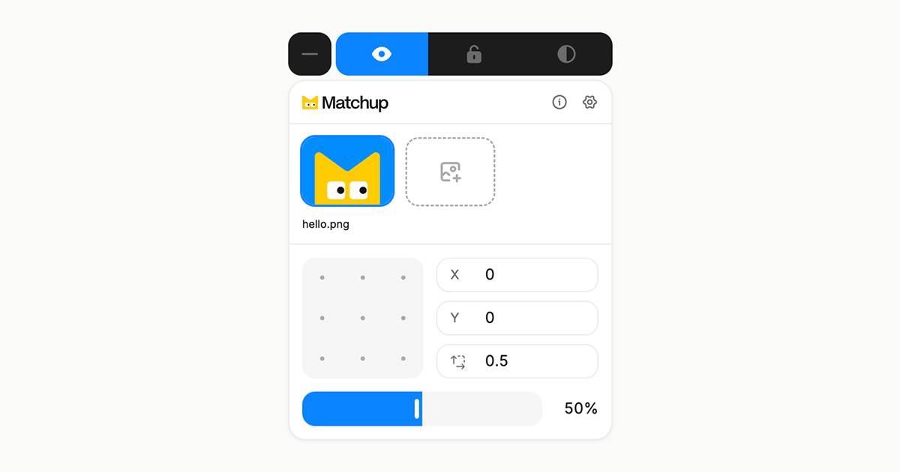

# Matchup

Matchup is a simple tool for comparing your design with your website. Drop your design on the page, line things up, and spot what's off.

## Install

1. [Download Matchup](https://github.com/salazarjoshua/matchup/releases/latest/download/matchup.zip).
2. Unzip it.
3. Open `chrome://extensions`.
4. Turn on **Developer mode**.
5. Click **Load unpacked** and select the `matchup` folder.
6. Done. 🎉

## What you can do

- **Supports** `PNG`, `JPG`, `WebP`, and `SVG`
- **Fine-tune** position, scale, and opacity
- **Scroll** the overlay with the page, or fix it to the window
- **Snap** to 9 positions
- **Spot** pixel differences
- **Lock or hide** layers
- **Reorder** layers
- **Customize** your shortcuts

### Shortcuts

Customize them to your preference.

| Shortcut                 | Action            |
| ------------------------ | ----------------- |
| <kbd>⌥</kbd><kbd>`</kbd> | Toggle panel      |
| <kbd>⌥</kbd><kbd>1</kbd> | Toggle visibility |
| <kbd>⌥</kbd><kbd>2</kbd> | Toggle lock       |
| <kbd>⌥</kbd><kbd>3</kbd> | Toggle difference |
| <kbd>⌥</kbd><kbd>U</kbd> | Upload image      |
| <kbd>⌘</kbd><kbd>V</kbd> | Paste image       |

## Update

Download the latest ZIP, replace the old folder, and hit **Refresh**.

That's it.
