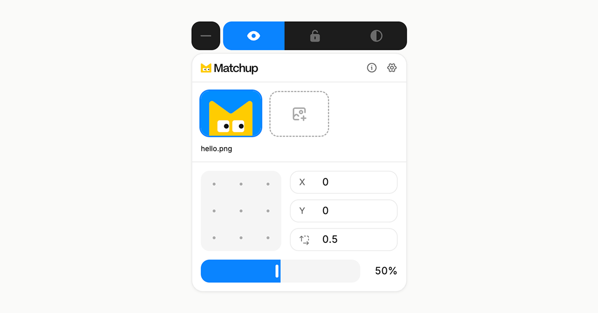

# Matchup

Overlay any image on any page. See how they match up.

Drop your design on the page, line things up, and spot what's off.

[Get Matchup](https://chromewebstore.google.com/detail/matchup/gpcahlemdmogeablcigdfpgcbmbpefek)

## What you can do

- Overlay any image on any page. `PNG`, `JPG`, `WebP`, and `SVG`.
- Position, size, scale, and opacity. Snap to 9 spots in 1 click.
- Invert a layer to spot what's off.
- Lock a layer and click through to the page underneath.
- Unlimited layers. Delete, rename, reorder.
- Layers saved per site.
- Scroll the overlay with the page, or fix it to the window.
- Dock the panel in the browser's side panel.
- Set your own defaults and shortcuts.

## Shortcuts

Customize them to your preference.

| Shortcut                 | Action            |
| ------------------------ | ----------------- |
| <kbd>⌥</kbd><kbd>`</kbd> | Toggle panel      |
| <kbd>⌥</kbd><kbd>1</kbd> | Toggle visibility |
| <kbd>⌥</kbd><kbd>2</kbd> | Toggle lock       |
| <kbd>⌥</kbd><kbd>3</kbd> | Toggle invert     |
| <kbd>⌥</kbd><kbd>U</kbd> | Upload image      |
| <kbd>⌘</kbd><kbd>V</kbd> | Paste image       |
